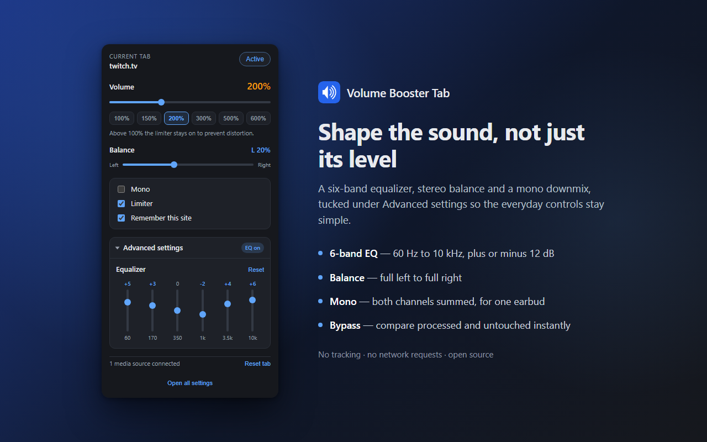
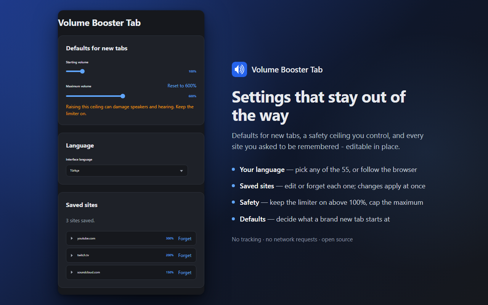

<div align="center">

# 🔊 Volume Booster Tab

**Boost any tab's volume up to 600% — with a limiter, equalizer and channel balance.**

Works in Chrome, Firefox, Edge, Opera, Brave, Vivaldi and Safari. Manifest V2 and V3 from one codebase.

[](https://chromewebstore.google.com/detail/volume-booster-tab/icmlbabfmbcmpjekdinfhblfpngadhad) [](https://addons.mozilla.org/en-US/firefox/addon/volume-booster-tab/) [](https://microsoftedge.microsoft.com/addons/detail/cpbcdpdcompfagchdibndboomcplhodk) [](https://addons.opera.com/extensions/details/volume-booster-tab/)

Safari builds from source — see [`docs/safari.md`](docs/safari.md).

[](LICENSE) [](#browser-support) [](#browser-support) [](#language-support) [](CONTRIBUTING.md)

[](https://github.com/ramazansancar/volume-booster-tab-extension/releases/latest) [](https://github.com/ramazansancar/volume-booster-tab-extension/releases/latest) [](https://github.com/ramazansancar/volume-booster-tab-extension/releases) [](https://github.com/ramazansancar/volume-booster-tab-extension/stargazers) [](https://github.com/ramazansancar/volume-booster-tab-extension/forks) [](https://github.com/ramazansancar/volume-booster-tab-extension/actions/workflows/ci.yml) [](https://github.com/ramazansancar/volume-booster-tab-extension/commits/master)

[](https://chromewebstore.google.com/detail/volume-booster-tab/icmlbabfmbcmpjekdinfhblfpngadhad) [](https://chromewebstore.google.com/detail/volume-booster-tab/icmlbabfmbcmpjekdinfhblfpngadhad) [](https://chromewebstore.google.com/detail/icmlbabfmbcmpjekdinfhblfpngadhad/reviews) [](https://chromewebstore.google.com/detail/icmlbabfmbcmpjekdinfhblfpngadhad/reviews) [](https://chromewebstore.google.com/detail/volume-booster-tab/icmlbabfmbcmpjekdinfhblfpngadhad)<br>
[](https://addons.mozilla.org/en-US/firefox/addon/volume-booster-tab/) [](https://addons.mozilla.org/en-US/firefox/addon/volume-booster-tab/) [](https://addons.mozilla.org/en-US/firefox/addon/volume-booster-tab/) [](https://addons.mozilla.org/en-US/firefox/addon/volume-booster-tab/reviews/) [](https://addons.mozilla.org/en-US/firefox/addon/volume-booster-tab/reviews/) [](https://addons.mozilla.org/en-US/firefox/addon/volume-booster-tab/versions/)<br>
[](https://microsoftedge.microsoft.com/addons/detail/cpbcdpdcompfagchdibndboomcplhodk) [](https://microsoftedge.microsoft.com/addons/detail/cpbcdpdcompfagchdibndboomcplhodk) [](https://microsoftedge.microsoft.com/addons/detail/cpbcdpdcompfagchdibndboomcplhodk) [](https://microsoftedge.microsoft.com/addons/detail/cpbcdpdcompfagchdibndboomcplhodk)<br>
[](https://addons.opera.com/extensions/details/volume-booster-tab/) [](https://addons.opera.com/extensions/details/volume-booster-tab/) [](https://addons.opera.com/extensions/details/volume-booster-tab/) [](https://addons.opera.com/extensions/details/volume-booster-tab/) [](https://addons.opera.com/extensions/details/volume-booster-tab/)

</div>

---

## Screenshots

<div align="center">


 

</div>

---

## Table of contents

- [Screenshots](#screenshots)
- [What it does](#what-it-does)
- [Browser support](#browser-support)
- [What works and what does not](#what-works-and-what-does-not)
- [Language support](#language-support)
- [Install](#install)
- [Build from source](#build-from-source)
- [How it works](#how-it-works)
- [Project layout](#project-layout)
- [FAQ](#faq)
- [Privacy](#privacy)
- [Contributing](#contributing)
- [License](#license)

---

## What it does

| Feature | Description |
| --- | --- |
| 🔊 **Volume boost** | 0–600% per tab, raisable to 1000% in settings |
| 🛡️ **Limiter** | Prevents clipping and painful peaks when boosting |
| 🎚️ **6-band equalizer** | 60 Hz – 10 kHz, ±12 dB, under *Advanced settings* |
| ↔️ **Channel balance** | Full left to full right |
| 🎧 **Mono downmix** | Both channels summed — for single-earbud listening |
| 📑 **Per-tab control** | Every tab has its own volume, independently |
| 🌍 **55 languages** | Interface follows your browser language |
| 🔒 **No tracking** | No network requests, no analytics, no account |

> [!TIP]
> Every tab keeps its own setting. You can run Twitch at 300% and YouTube at 150% at the same time — changing one never touches the other.

> [!NOTE]
> By default a boost is **temporary**: closing the tab forgets it. Tick **Remember this site** in the popup if you want a site to reopen at the same volume, or change the default in the options page.

---

## Browser support

There are only three browser engines. Everything else is a fork that runs one of these builds unchanged.

| Engine | Build target | Browsers | Manifest |
| --- | --- | --- | --- |
| **Chromium** | `chrome-mv3` | Chrome 88+, Brave, Vivaldi, Arc, Yandex | V3 |
| **Chromium** | `edge-mv3` | Microsoft Edge 88+ | V3 |
| **Chromium** | `chrome-mv2` | Chromium forks still on Manifest V2 | V2 |
| **Chromium** | `opera-mv3` | Opera | V3 |
| **Gecko** | `firefox-mv3` | Firefox 109+ | V3 |
| **Gecko** | `firefox-mv2` | Firefox 91+ ESR, LibreWolf, Waterfox, Zen, Floorp, Firefox for Android | V2 |
| **WebKit** | `safari-mv3` | Safari 16.4+ on macOS and iOS | V3 |

> [!IMPORTANT]
> Safari needs an extra conversion step with Xcode before it can be installed. See [`docs/safari.md`](docs/safari.md).

<details>
<summary><b>Why so many targets?</b></summary>

<br>

The two manifest versions differ in ways that cannot be papered over at runtime:

| | Manifest V2 | Manifest V3 |
| --- | --- | --- |
| Toolbar button | `browser_action` | `action` |
| Background | Background page (`scripts`) | Service worker (Chromium) / event page (Firefox) |
| Host access | Inside `permissions` | Separate `host_permissions` |
| CSP | A single string | An object keyed by context |

On top of that, Firefox MV3 does **not** support `service_worker` and needs `background.scripts` instead, so "MV3" alone is not one shape either.

All of this is generated from a single description in [`scripts/manifest.mjs`](scripts/manifest.mjs). Adding a permission is one edit, not seven.

</details>

---

## What works and what does not

Knowing this up front saves a lot of confusion.

### Works everywhere

| Site type | Example | Notes |
| --- | --- | --- |
| ✅ Standard HTML5 video | YouTube, Vimeo, Twitch, Odysee | Full support |
| ✅ HTML5 audio | SoundCloud, Bandcamp, web radio | Full support |
| ✅ Embedded players | Videos inside articles and iframes | Settings are delivered to every frame |
| ✅ Single-page apps | Netflix episode changes, YouTube playlists | The next video is caught automatically |

### Limited or unavailable

> [!WARNING]
> Some pages cannot be boosted at all, and no extension can change that. This is a browser security boundary, not a bug.

| Situation | Why | Workaround |
| --- | --- | --- |
| ⚠️ **Cross-origin media without CORS** | The browser refuses to expose the samples to `createMediaElementSource` | **Try tab capture** in the popup (Chromium only) |
| ⚠️ **DRM-protected video** (Prime Video, Netflix, Disney+) | The browser hands over the decrypted audio only once the player has its keys, so the boost attaches when playback starts, not before. Tested on Prime Video in Firefox and Brave | Start playback, then set the level |
| ❌ **Browser pages** (`chrome://`, `about:`, the Web Store) | Extensions are not allowed to run there | None — by design |
| ❌ **Local files** (`file://`) | Off by default | Enable file access in the extension's details page |
| ❌ **Firefox + cross-origin media** | Firefox has no `tabCapture` API, so there is no fallback to offer | None currently |
| ❌ **Audio outside the page** (system sound, other apps) | An extension only sees its own browser tabs | Use your OS volume mixer |

<details>
<summary><b>How can I tell which path a tab is using?</b></summary>

<br>

The popup tells you at the bottom:

| Status | Meaning |
| --- | --- |
| *N media sources connected* | Working normally through the Web Audio path |
| *No audio playing yet* | Nothing to boost on this page yet — start playback |
| *Using tab capture* | Fallback path is active (Chromium only) |
| *This page blocks audio processing* | The Web Audio path failed. On Chromium a **Try tab capture** button appears underneath |
| *Browser pages cannot be boosted* | You are on an internal browser page |

</details>

> [!CAUTION]
> Boosting above 100% can damage speakers and hearing, especially with headphones. The limiter is on by default above 100% and you should leave it on. Raising the ceiling past 600% in the options page is entirely at your own risk.

---

## Language support

The interface follows your browser's language by default, and you can pick a specific one in the settings page.

All 55 locales are fully translated — every string, in every language, with no English fallbacks. The translations are machine-assisted, so **corrections from native speakers are especially welcome**; see [Contributing](#contributing).

<details>
<summary><b>All 55 languages</b></summary>

<br>

| | | | |
| --- | --- | --- | --- |
| 🇪🇹 አማርኛ (`am`) | 🇸🇦 العربية (`ar`) | 🇧🇬 Български (`bg`) | 🇧🇩 বাংলা (`bn`) |
| 🇪🇸 Català (`ca`) | 🇨🇿 Čeština (`cs`) | 🇩🇰 Dansk (`da`) | 🇩🇪 Deutsch (`de`) |
| 🇬🇷 Ελληνικά (`el`) | 🇬🇧 English (`en`) | 🇦🇺 English AU (`en_AU`) | 🇬🇧 English UK (`en_GB`) |
| 🇺🇸 English US (`en_US`) | 🇪🇸 Español (`es`) | 🇲🇽 Español LatAm (`es_419`) | 🇪🇪 Eesti (`et`) |
| 🇮🇷 فارسی (`fa`) | 🇫🇮 Suomi (`fi`) | 🇵🇭 Filipino (`fil`) | 🇫🇷 Français (`fr`) |
| 🇮🇳 ગુજરાતી (`gu`) | 🇮🇱 עברית (`he`) | 🇮🇳 हिन्दी (`hi`) | 🇭🇷 Hrvatski (`hr`) |
| 🇭🇺 Magyar (`hu`) | 🇮🇩 Indonesia (`id`) | 🇮🇹 Italiano (`it`) | 🇯🇵 日本語 (`ja`) |
| 🇮🇳 ಕನ್ನಡ (`kn`) | 🇰🇷 한국어 (`ko`) | 🇱🇹 Lietuvių (`lt`) | 🇱🇻 Latviešu (`lv`) |
| 🇮🇳 മലയാളം (`ml`) | 🇮🇳 मराठी (`mr`) | 🇲🇾 Melayu (`ms`) | 🇳🇱 Nederlands (`nl`) |
| 🇳🇴 Norsk (`no`) | 🇵🇱 Polski (`pl`) | 🇧🇷 Português BR (`pt_BR`) | 🇵🇹 Português PT (`pt_PT`) |
| 🇷🇴 Română (`ro`) | 🇷🇺 Русский (`ru`) | 🇸🇰 Slovenčina (`sk`) | 🇸🇮 Slovenščina (`sl`) |
| 🇷🇸 Српски (`sr`) | 🇸🇪 Svenska (`sv`) | 🇰🇪 Kiswahili (`sw`) | 🇮🇳 தமிழ் (`ta`) |
| 🇮🇳 తెలుగు (`te`) | 🇹🇭 ไทย (`th`) | 🇹🇷 Türkçe (`tr`) | 🇺🇦 Українська (`uk`) |
| 🇻🇳 Tiếng Việt (`vi`) | 🇨🇳 简体中文 (`zh_CN`) | 🇹🇼 繁體中文 (`zh_TW`) | |

</details>

> [!TIP]
> Spotted a translation that reads awkwardly in your language? Corrections are very welcome and are a great first contribution — see [Contributing](#contributing).

> [!NOTE]
> All translations live in one table in [`scripts/locales.mjs`](scripts/locales.mjs). Add your language there and run `pnpm run locales` — you never edit 55 JSON files by hand.

---

## Install

### From a store

| Store | Status | Link |
| --- | --- | --- |
| **Chrome Web Store** | ✅ Published | [](https://chromewebstore.google.com/detail/volume-booster-tab/icmlbabfmbcmpjekdinfhblfpngadhad) |
| **Firefox Add-ons** | ✅ Published | [](https://addons.mozilla.org/en-US/firefox/addon/volume-booster-tab/) |
| **Microsoft Edge Add-ons** | ✅ Published | [](https://microsoftedge.microsoft.com/addons/detail/cpbcdpdcompfagchdibndboomcplhodk) |
| **Opera add-ons** | ✅ Published | [](https://addons.opera.com/extensions/details/volume-booster-tab/) |
| **Safari** | ❌ Not planned | [](docs/safari.md) |

> [!NOTE]
> The Firefox listing also covers LibreWolf, Waterfox, Zen, Floorp and Firefox for Android. Other Chromium forks (Brave, Vivaldi, Arc) can install the [Chrome Web Store](https://chromewebstore.google.com/detail/volume-booster-tab/icmlbabfmbcmpjekdinfhblfpngadhad) build directly.

### Store stats

Live numbers from each store, refreshed by [shields.io](https://shields.io). A dash means the store does not publish that figure. Firefox downloads are per week; Opera only reports downloads, and the Chrome Web Store and Edge only report users.

| | Chrome Web Store | Firefox Add-ons | Microsoft Edge Add-ons | Opera add-ons |
| --- | --- | --- | --- | --- |
| **Version** | [](https://chromewebstore.google.com/detail/volume-booster-tab/icmlbabfmbcmpjekdinfhblfpngadhad) | [](https://addons.mozilla.org/en-US/firefox/addon/volume-booster-tab/) | [](https://microsoftedge.microsoft.com/addons/detail/cpbcdpdcompfagchdibndboomcplhodk) | [](https://addons.opera.com/extensions/details/volume-booster-tab/) |
| **Users** | [](https://chromewebstore.google.com/detail/volume-booster-tab/icmlbabfmbcmpjekdinfhblfpngadhad) | [](https://addons.mozilla.org/en-US/firefox/addon/volume-booster-tab/) | [](https://microsoftedge.microsoft.com/addons/detail/cpbcdpdcompfagchdibndboomcplhodk) | — |
| **Downloads** | — | [](https://addons.mozilla.org/en-US/firefox/addon/volume-booster-tab/) | — | [](https://addons.opera.com/extensions/details/volume-booster-tab/) |
| **Rating** | [](https://chromewebstore.google.com/detail/icmlbabfmbcmpjekdinfhblfpngadhad/reviews) | [](https://addons.mozilla.org/en-US/firefox/addon/volume-booster-tab/reviews/) | [](https://microsoftedge.microsoft.com/addons/detail/cpbcdpdcompfagchdibndboomcplhodk) | [](https://addons.opera.com/extensions/details/volume-booster-tab/) |
| **Ratings** | [](https://chromewebstore.google.com/detail/icmlbabfmbcmpjekdinfhblfpngadhad/reviews) | [](https://addons.mozilla.org/en-US/firefox/addon/volume-booster-tab/reviews/) | [](https://microsoftedge.microsoft.com/addons/detail/cpbcdpdcompfagchdibndboomcplhodk) | [](https://addons.opera.com/extensions/details/volume-booster-tab/) |
| **Written reviews** | — | [](https://addons.mozilla.org/en-US/firefox/addon/volume-booster-tab/reviews/) | — | — |
| **Size** | [](https://chromewebstore.google.com/detail/volume-booster-tab/icmlbabfmbcmpjekdinfhblfpngadhad) | [](https://addons.mozilla.org/en-US/firefox/addon/volume-booster-tab/) | — | [](https://addons.opera.com/extensions/details/volume-booster-tab/) |
| **Last updated** | [](https://chromewebstore.google.com/detail/volume-booster-tab/icmlbabfmbcmpjekdinfhblfpngadhad) | [](https://addons.mozilla.org/en-US/firefox/addon/volume-booster-tab/) | — | [](https://addons.opera.com/extensions/details/volume-booster-tab/) |
| **Listed since** | — | [](https://addons.mozilla.org/en-US/firefox/addon/volume-booster-tab/) | — | — |
| **Minimum version** | — | [](https://addons.mozilla.org/en-US/firefox/addon/volume-booster-tab/) [](https://addons.mozilla.org/en-US/firefox/addon/volume-booster-tab/) | — | — |
| **Category** | — | [](https://addons.mozilla.org/en-US/firefox/addon/volume-booster-tab/) | [](https://microsoftedge.microsoft.com/addons/detail/cpbcdpdcompfagchdibndboomcplhodk) | [](https://addons.opera.com/extensions/details/volume-booster-tab/) |

**Repository**

[](https://github.com/ramazansancar/volume-booster-tab-extension/watchers) [](https://github.com/ramazansancar/volume-booster-tab-extension/graphs/contributors) [](https://github.com/ramazansancar/volume-booster-tab-extension/issues) [](https://github.com/ramazansancar/volume-booster-tab-extension/issues?q=is%3Aissue+is%3Aclosed) [](https://github.com/ramazansancar/volume-booster-tab-extension/pulls) [](https://github.com/ramazansancar/volume-booster-tab-extension/graphs/commit-activity) [](https://github.com/ramazansancar/volume-booster-tab-extension)

### From source (unpacked)

```bash
git clone https://github.com/ramazansancar/volume-booster-tab-extension.git
cd volume-booster-tab-extension
pnpm install
pnpm run build
```

Then load the folder for your browser:

<details>
<summary><b>Chrome, Edge, Brave, Vivaldi, Opera</b></summary>

<br>

1. Open `chrome://extensions` (or `edge://extensions`, `opera://extensions`)
2. Turn on **Developer mode**
3. Click **Load unpacked**
4. Select `dist/chrome-mv3` (or `dist/edge-mv3`, `dist/opera-mv3`)

</details>

<details>
<summary><b>Firefox</b></summary>

<br>

1. Open `about:debugging#/runtime/this-firefox`
2. Click **Load Temporary Add-on**
3. Select `dist/firefox-mv2/manifest.json`

> [!NOTE]
> Temporary add-ons are removed when Firefox closes. For a permanent install use the signed [AMO listing](https://addons.mozilla.org/en-US/firefox/addon/volume-booster-tab/).

</details>

<details>
<summary><b>Safari</b></summary>

<br>

Safari requires converting the extension into an Xcode project first. See [`docs/safari.md`](docs/safari.md) for the full walkthrough.

</details>

---

## Build from source

> [!NOTE]
> **pnpm is recommended but not required.** npm and yarn work exactly the same — substitute `npm run` or `yarn` for `pnpm run` everywhere below. Node.js 20 or newer is needed.

```bash
pnpm install              # install dev dependencies
pnpm run dev              # watch build for Chrome MV3
pnpm run dev:firefox      # watch build for Firefox MV2
pnpm run build            # build all 7 targets into dist/
pnpm run package          # build all targets AND zip each for store upload
```

> [!IMPORTANT]
> Uploading to a store? Use **`pnpm run package`**, not `pnpm run build`. `build` refreshes the unpacked folders only — it deletes any existing zip rather than updating it, so that a stale archive can never be uploaded by mistake.
>
> Store paperwork lives in [`docs/`](docs/): [publishing](docs/publishing.md) for which build goes where, [AMO](docs/amo-submission.md) for Firefox, [Chrome Web Store](docs/chrome-submission.md) for Chrome and Edge, [Opera](docs/opera-submission.md) for Opera, [Safari](docs/safari.md) for the Xcode conversion, and [store descriptions](docs/store-descriptions.md) for the per-language listing text.

<details>
<summary><b>All available scripts</b></summary>

<br>

| Script | What it does |
| --- | --- |
| `pnpm run dev` | Watch build, Chrome MV3, unminified with sourcemaps |
| `pnpm run dev:firefox` | Watch build, Firefox MV2 |
| `pnpm run build` | Build every target |
| `pnpm run build:chrome` | Chrome MV3 + MV2 only |
| `pnpm run build:firefox` | Firefox MV3 + MV2 only |
| `pnpm run build:edge` | Edge MV3 only |
| `pnpm run build:opera` | Opera MV3 only |
| `pnpm run build:safari` | Safari MV3 only |
| `pnpm run package` | Build everything and produce store-ready zips |
| `pnpm run icons` | Regenerate the PNG icons from code |
| `pnpm run locales` | Regenerate all 55 locale files from the translation table |
| `pnpm run typecheck` | TypeScript, no emit |
| `pnpm test` | Run the test suite |
| `pnpm run lint` | ESLint |
| `pnpm run format` | Prettier |

You can also target the build script directly:

```bash
node scripts/build.mjs --target=firefox-mv2 --watch
node scripts/build.mjs --target=chrome-mv3,edge-mv3
node scripts/build.mjs --all --zip
node scripts/build.mjs --help
```

</details>

---

## How it works

The extension boosts audio by routing the page's media through a Web Audio graph.

```
 <video> / <audio>
        │
        ▼
  MediaElementSource
        │
        ▼
 ┌──────────────────────────────────────────────┐
 │  6-band equalizer   (BiquadFilterNode × 6)   │  cuts make headroom
 │           ▼                                   │
 │  Limiter            (DynamicsCompressorNode)  │  catches peaks
 │           ▼                                   │
 │  Boost              (GainNode, 0–10×)         │  the actual amplification
 │           ▼                                   │
 │  Balance / mono     (StereoPannerNode)        │  redistributes channels
 └──────────────────────────────────────────────┘
        │
        ▼
   destination  →  your speakers
```

The equalizer sits **before** the boost so that band cuts create headroom, and the limiter sits **before** the gain node so it sees a predictable input level.

<details>
<summary><b>Keeping up with single-page apps</b></summary>

<br>

The hardest part of a volume booster is not the audio — it is noticing when the page swaps its player out. On Netflix, YouTube and Twitch, moving to the next episode does not reload the document: the old `<video>` is removed and a new one is inserted, often before it has any media attached.

A naive extension attaches once, never sees the swap, and leaves you with a popup claiming 400% while the audio plays at 100%. Six mechanisms work together to prevent that:

| Mechanism | Catches |
| --- | --- |
| `MutationObserver` | Elements added to or removed from the DOM |
| Capture-phase media events | Elements inside shadow roots the observer cannot see |
| Re-apply on every attach | The new element inherits the volume you already set |
| Retry with backoff (6 attempts) | Players that insert an empty `<video>` and set `.src` later |
| `pushState` / `replaceState` hooks | SPA route changes that never touch the network |
| Slow periodic sweep (3 s) | Anything the five above somehow missed |

The sweep only runs while a boost is actually applied and the tab is visible, so an idle tab costs nothing.

</details>

<details>
<summary><b>Where settings live</b></summary>

<br>

Per-tab state is held in memory in the background script and is **deliberately not persisted**. That is what makes a boost disappear when its tab closes.

Only when you tick **Remember this site** is a setting written to `storage.local`, keyed by origin. You can review and delete every saved site in the options page.

Nothing is ever sent anywhere. The extension makes no network requests at all.

</details>

---

## Project layout

```
volume-booster-tab-extension/
├── src/
│   ├── lib/                  Shared logic, no browser API assumptions
│   │   ├── audio-engine.ts     The Web Audio graph
│   │   ├── browser.ts          chrome.* / browser.* compatibility layer
│   │   ├── storage.ts          Preferences and per-origin settings
│   │   ├── validate.ts         Coercing untrusted input into safe settings
│   │   └── defaults.ts         Neutral values and safety ceilings
│   ├── background/           Service worker (MV3) / background page (MV2)
│   │   ├── index.ts            Message routing and tab lifecycle
│   │   └── tab-registry.ts     One independent state per tab
│   ├── content/              Injected into pages, finds and routes media
│   ├── popup/                Toolbar UI
│   ├── options/              Settings page
│   └── types/                Cross-context message and state contracts
├── scripts/
│   ├── build.mjs             esbuild bundling, 7 targets, zip packaging
│   ├── manifest.mjs          Generates each target's manifest.json
│   ├── icons.mjs             Renders PNG icons from code, no dependencies
│   └── locales.mjs           Generates all 55 _locales files
├── public/                   Icons and generated locale files
├── tests/                    Vitest unit tests
└── dist/                     Build output, one folder per target
```

---

## FAQ

<details>
<summary><b>Why does another extension claim 2000% and this one 600%?</b></summary>

Because 600% is roughly where the number stops meaning anything.

A gain node will happily multiply by twenty. What it cannot do is make the sound card accept it: the signal is clamped to a fixed range at the end of the chain, and a typical track already peaks near the top of that range. Multiplying by twenty throws most of the waveform away, and what you hear is clipping — the harsh, crackly distortion people then describe as "noise".

The ceiling here is 600% by default and 1000% at most, which is the range the limiter can keep clean. You can raise it in the settings; the warning next to it is there because loud is a speaker and hearing problem before it is an audio-quality one.

</details>

<details>
<summary><b>The volume slider moves but nothing gets louder.</b></summary>

Check the status line at the bottom of the popup — it says which path is in use and, when nothing can be done, why.

The usual causes:

- **Cross-origin media without CORS headers.** The page can play it but scripts cannot read it. On Chromium there is a **Try tab capture** button in the popup for this; it lights the tab's recording indicator, which is why it is offered rather than used automatically.
- **The page has not started playing yet.** The boost attaches to media elements as they appear, so press play first.

</details>

<details>
<summary><b>Does it keep the volume for a site next time I visit?</b></summary>

Only if you ask it to. Tick **Remember this site** in the popup, or change the default under *When a tab closes* in the settings.

The default is deliberately the forgetful one: a 600% boost that survives silently until the next visit is how people get startled.

</details>

<details>
<summary><b>What is the limiter for, and should I turn it off?</b></summary>

It catches peaks before they clip, which is what stops a boosted track from crackling on loud passages. Leave it on above 100%.

It is worth switching off only when you are boosting something very quiet and uniform — a voice recording, say — and want to hear exactly what is there.

</details>

<details>
<summary><b>Bass/mid/treble or the six-band equalizer — which should I use?</b></summary>

They are the same setting at two resolutions. The three tone controls write the same six bands, with overlapping ranges so each shades into the next the way an amplifier's tone stack does.

Use the three for a quick shape. Open **Advanced settings** for the six when you want one specific range and nothing around it — each band is named for what it does to the sound rather than just its frequency.

</details>

<details>
<summary><b>Can I move my settings to another browser or computer?</b></summary>

Yes. **Backup and transfer** in the settings exports everything — defaults, saved sites and presets — to a JSON file, and imports it anywhere else.

The file records its own format version, and every version this extension has ever written can still be imported, so an old backup does not stop working after an update.

</details>

<details>
<summary><b>Why does the popup close when I click away?</b></summary>

That is how browser popups work; the extension cannot prevent it.

Use the detach button in the popup's top-right corner to open the same panel as a separate window that stays put while you work in the page.

</details>

<details>
<summary><b>Does it slow the page down or use the network?</b></summary>

No network, ever — the extension makes no requests of any kind, and nothing you do leaves your machine. See [Privacy](#privacy).

The audio work happens in the browser's own audio engine on a dedicated thread. On an idle tab there is no graph at all: it is built when audio starts and torn down when the tab goes away.

</details>

<details>
<summary><b>Is there an equalizer preset for my kind of listening?</b></summary>

There are eighteen built in, covering situations (Speech, Cinema, Night, Outdoors) and genres (Rock, Jazz, Classical, Hip-hop and more).

If none fits, dial in your own and press **+** beside the preset list to save it under a name. Saved presets can be renamed, reordered and deleted on the settings page.

</details>

<details>
<summary><b>It says "Browser pages cannot be boosted".</b></summary>

Extensions are not allowed to run on the browser's own pages — `chrome://`, `about:`, the web store, the new-tab page — so there is nothing for the boost to attach to. Open a normal web page and the controls come back.

</details>

## Privacy

The extension collects nothing, sends nothing, and makes no network requests at all. Per-tab boost state lives in memory only; a site preference is written to `storage.local` solely when you tick **Remember this site**, and you can delete it from the options page at any time.

Full text: **[PRIVACY.md](PRIVACY.md)**.

---

## Contributing

Pull requests are very welcome. See [CONTRIBUTING.md](CONTRIBUTING.md) for the full guide.

**Good first contributions:**

| | |
| --- | --- |
| 🌍 **Translate a language** | One table in `scripts/locales.mjs`, no JSON files to touch |
| 🐛 **Report a site that does not work** | Include the URL and what the popup status said |
| 🎚️ **Suggest equalizer presets** | Bass boost, voice clarity, night mode |
| 📝 **Improve the docs** | If something confused you, it will confuse others |

> [!TIP]
> Before opening a PR, run `pnpm run typecheck && pnpm test && pnpm run lint`. The CI runs the same three commands.

---

## License

[GNU Affero General Public License v3.0](LICENSE)

> [!IMPORTANT]
> **You may** use, study, modify, redistribute and fork this software — including commercially.
>
> **You must**, if you distribute it or run a modified version as a network service, release your version's complete source under the AGPL too. That obligation extends to server-side use, which is what separates the AGPL from the ordinary GPL.
>
> The software is provided **as is, without warranty of any kind**, and the author accepts **no liability** for any damage arising from its use — including damage to hearing or audio equipment from excessive amplification.

Contributions are accepted under the same license.

---

<div align="center">

Made by [Ramazan Sancar](https://github.com/ramazansancar)

</div>
