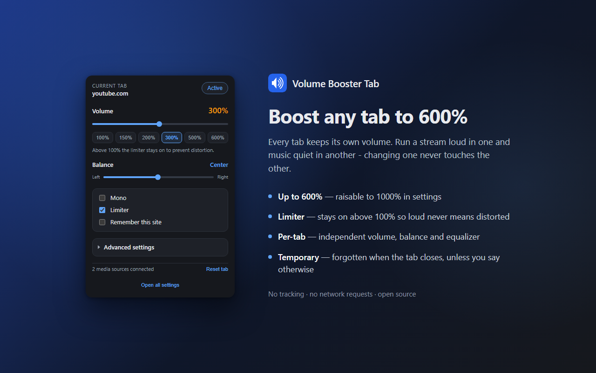

# ✅ Volume Booster Tab is installed

**Thanks for choosing it! ❤️**

Volume Booster Tab is free and open source. Nobody tracks you and you never need an account.
If it helps you, a ⭐ on this repository is the easiest way to say thanks. It also helps other people find the extension.

The **Star** button is at the top right of this page.

---

## 📌 Pin it to the toolbar

Pinning keeps the icon one click away.

### Chrome, Edge, Brave, Vivaldi and Opera

1. Click the **Extensions** button (the 🧩 puzzle piece) next to the address bar.
2. Find **Volume Booster Tab** and click the 📌 pushpin next to it.
3. The pushpin turns blue and the icon appears in the toolbar.

### Firefox

1. Click the **Extensions** button (the 🧩 puzzle piece) in the toolbar.
2. Click the ⚙️ gear next to **Volume Booster Tab**.
3. Choose **Pin to Toolbar**.

## 🔊 Boost your first tab

1. Open a tab with audio or video and press play.
2. Click the **Volume Booster Tab** icon.
3. Drag the slider. You can go from 0% up to 600%.

## Good to know

- **Each tab has its own volume.** You can run one tab at 300% and another at 150%. Changing one never touches the other.
- **By default a boost is temporary.** Closing the tab forgets it. Tick **Remember this site** in the popup if you want a site to open at the same volume next time.
- **The limiter keeps loud audio clean.** Leave it on when you go above 100%. Loud audio can damage speakers and hearing.
- **More controls are under _Advanced settings_.** You get a 6-band equalizer, channel balance and mono.
- **Nothing leaves your browser.** The extension collects no data. Read the [privacy policy](../PRIVACY.md).

## Something not working?

- Check the status line at the bottom of the popup. It tells you which method is in use, and when nothing can be done, it tells you why.
- Read the [FAQ](../README.md#faq).
- Still stuck? [Open an issue](https://github.com/ramazansancar/volume-booster-tab-extension/issues/new).

## Get involved

This extension is licensed under [AGPL-3.0](../LICENSE), and pull requests are welcome. Translations, bug reports and code all help. Start with the [contributing guide](../CONTRIBUTING.md).

**Enjoying it? [⭐ Star the repository](https://github.com/ramazansancar/volume-booster-tab-extension)**

